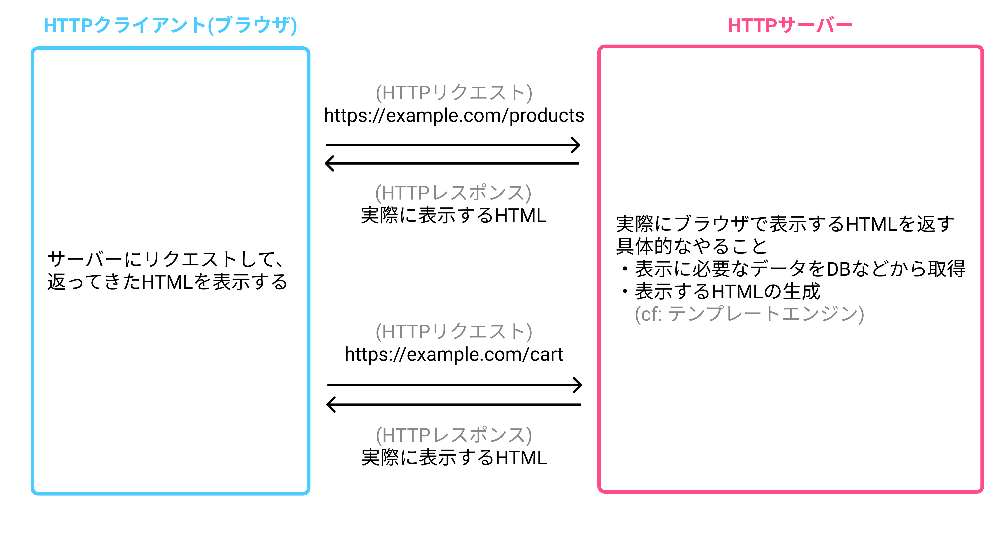
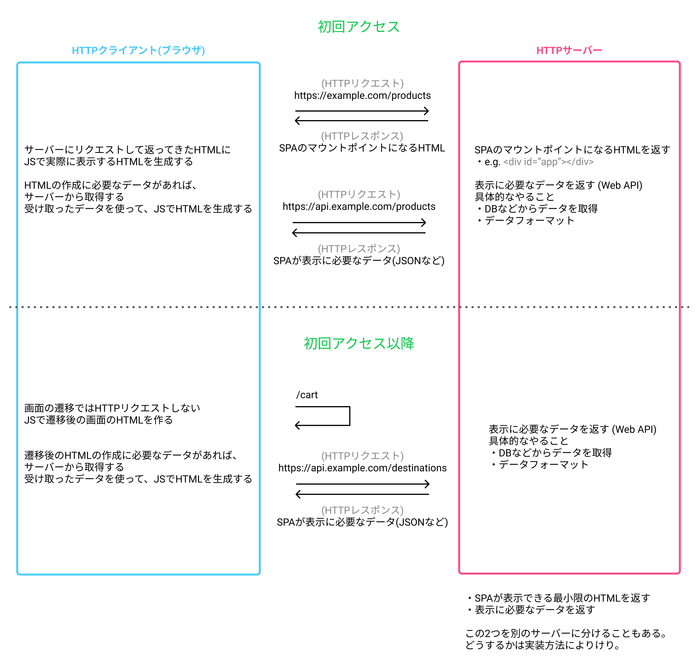

# アプリケーションの形式
UIがあるWebアプリケーションの形式として、大きく2つの種類があります。
- MPA (Multiple Page Application)
- SPA (Single Page Application)

これらの形式がどう違うのか見てみましょう。

## MPA (Multiple Page Application)
MPAとは、画面遷移を行うたびにサーバーからページ(HTML)を返すアプリケーションです。SPAが登場するより以前からある形式です。動的な内容(ログイン中のアカウント名のようなユーザーによって異なる内容)も、サーバー内でDBにアクセスし、テンプレートエンジンでHTMLを生成するなどで対応します。

MPAの特徴
- 別の画面に遷移する度に、サーバー側でHTMLを生成し直す
  - サーバーの仕事が多い (データの処理以外に、表示内容に応じたHTMLの生成も行う必要がある)

実際のサービスで確認する 
- [ネットショップ作成サービス カラーミーショップ](https://shop-pro.jp/)
  - 画面遷移のたびに表示内容が入ったHTMLを受け取っていること

## SPA (Single Page Application)
SPAとは、アプリケーションへの初回アクセス時にサーバーからHTMLを返したあとは、画面遷移をしてもサーバーからHTMLを返してもらわない(つまり、アプリケーションにおいて、1つのページしか使わない)アプリケーションです。ちなみに、返してもらうHTMLもbody要素が`

`(SPAのマウントポイントと呼ばれます)くらいしかない質素なものだったりします。そんな質素なHTMLからどうやって実際の見た目を作るかというと、JSを使ってHTMLを組み立てます。SPAを作る際によく使われる描画処理ライブラリ(e.g. [Vue.js](https://jp.vuejs.org/index.html)や[React](https://ja.reactjs.org/))はマウントポイントに対して処理を行い、HTMLを組み立てるので、初回アクセス時にはマウントポイントになるHTMLが必要なのです。

次に画面遷移時についてです。MPAのようにHTMLを返してもらわずに、どうやって表示内容の切り替えをするかというと、こちらJSで処理してしまいます。JSで遷移先のページを特定し、HTMLを書き換えてしまうのですね。動的な内容は、JSからサーバーへ通信して受け取った値を使います(このような処理を`Ajax`と言います)。この時の通信先のサーバーは、主に`JSON`などの形式でデータを返すWeb APIを実装したサーバーになります。

SPAの特徴
- サーバーから返されるHTMLは初回に受け取る1つだけ(マウントポイントになるHTML)
  - 実際に表示する内容のHTMLはJSで生成する (ブラウザで行う仕事が多い)
- サーバーで行う仕事がシンプルに (基本的にデータを供給するだけ)
- 開発対象が分割しやすいので、サーバーサイドとフロントエンドの分業がしやすい
  - (extra) 分業をしやすくする手法の一例: [スキーマファースト開発のススメ - onk.ninja](https://blog.onk.ninja/2017/09/21/schema_first_development)
- 画面遷移が速くなる (HTTP通信でやり取りするデータ量が減るなどの要因から)
- ブラウザによる挙動に縛られない実装ができる
  - e.g. 画面遷移をアニメーションによるシームレスなものにする
  - デメリットとして、ブラウザが用意している挙動が利用できないので、車輪の再発明が必要になる (e.g. スクロール制御)
- meta要素(サーバーから返される時点で描画されている必要がある)が必要な場合は、対応方法を考える必要がある

実際のサービスで確認する
- [ログイン - カラーミーリピート](https://your.colorme-repeat.jp/login) (管理画面がSPAなので、そこで確認)
  - 初回アクセス時に、SPAのマウントポイントになるHTMLを返していること
  - 画面遷移ではHTMLを返していないこと
  - 画面遷移ではAjax通信をして、Web APIからデータを取得していること

## MPAとSPAどちらを採用すれば？
要件に依ると思います。ただ、検討時の参考になりそうなスライドがあるので、載せておきます。[私たちはなぜ SPA で開発するのか / Why you choose SPA - Speaker Deck](https://speakerdeck.com/potato4d/why-you-choose-spa)
