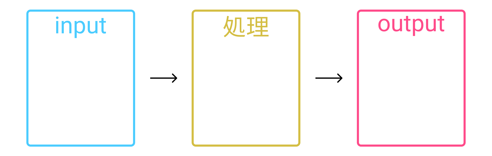
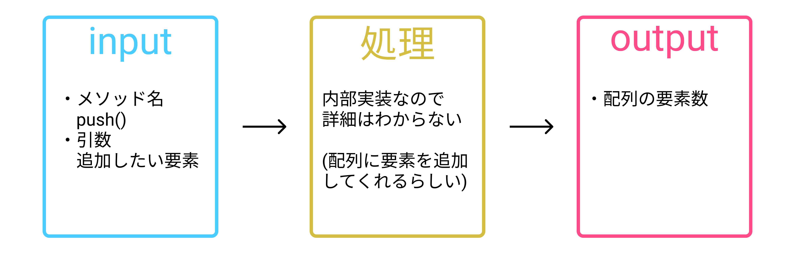
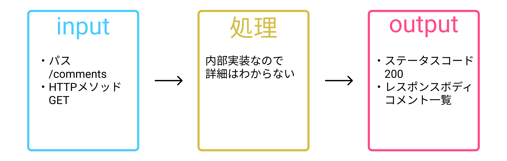
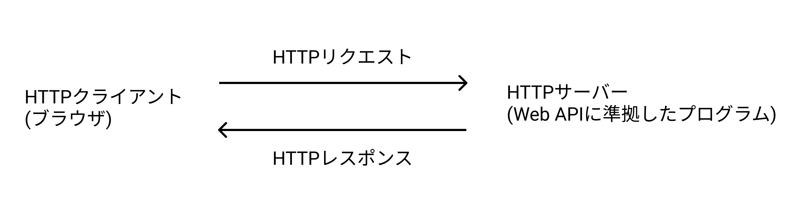
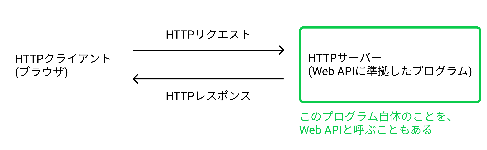

# JSからGETリクエストしてみよう

コードで説明する前に、Web APIの利用に必要な知識を見てみましょう。

## Web APIとは
Web APIについて知るために、まずはAPIについて知りましょう。

APIとは`Application Programming Interface`の略で、あるソフトウェアが、自身の機能を外部からも利用できるように提供するインターフェースの仕様です。つまり、「こうやって呼び出してもらえば、あんな処理をして、こんな値を返します」といったことが定義されています。`input -> 処理 -> output`の流れがあるのですね。

例えば、前の単元で利用したJSの配列のメソッドである、[push()](https://developer.mozilla.org/ja/docs/Web/JavaScript/Reference/Global_Objects/Array/push)に当てはめるとこんな感じになります。

APIについて理解したところで、話をWeb APIに戻します。
Web APIはAPIの一種で、[HTTPプロトコル](https://developer.mozilla.org/ja/docs/Web/HTTP/Overview)を使ってインターネット越しに、自身の機能を外部からも利用できるように提供するインターフェースの仕様のことです。先ほどと同じ図に当てはめて、[今回の掲示板アプリの開発で使うWeb API](http://localhost:4000/spec/)を見てみましょう。

「inputにある`パス`や、outputにある`ステータスコード`って何だろう？」と思ってる人もいるかと思います。これはHTTPプロトコルの仕様です(Web APIはHTTPプロトコルを使うAPIでしたね)。HTTPプロトコルについての解説は時間の関係で行いませんが、以下の本を読むなどすると理解が深まると思います。

- [Webを支える技術 ── HTTP，URI，HTML，そしてREST](https://gihyo.jp/magazine/wdpress/plus/978-4-7741-4204-3)
- [O'Reilly Japan - Real World HTTP 第2版](https://www.oreilly.co.jp/books/9784873119038/)

上記の図の通りWeb APIでは、inputがHTTPリクエスト、outputがHTTPレスポンスになります。実際にWeb APIを利用するときに確認することが多い項目として、以下のような項目があります。

HTTPリクエストに関連する要素
- HTTPメソッド
- パス
- パラメータ (e.g. クエリストリング, リクエストボディ)
- ヘッダー

HTTPレスポンスに関連する要素
- ステータスコード
- レスポンスボディ (フォーマットはWeb APIによりけりですが、[JSON](https://developer.mozilla.org/ja/docs/Glossary/JSON)が多いでしょう)

ここまででWeb APIとは何かがわかりました。この単元の表題である「JSからGETリクエストしてみよう」のゴールである、ブラウザ(で動作するJS)からWeb APIを利用する時の全体像を載せておきます。

補足

文脈によっては、「API」と言っただけで「Web API」を指している場合もあります。あるいは、機能を提供しているソフトウェア自体(Web APIサーバー)のことを「API」と呼ぶこともあります。文脈依存でわかりにくいですが、大体ここで書いたどれかに当てはまるかなと思います。

## 利用したいWeb APIでできることを知る方法
利用したいWeb APIによってどんな機能が提供されており、どうやって利用するかを知りたいときはどうすればいいでしょうか？答えはJSなどのプログラム言語にAPIリファレンスがあるように、Web APIのリファレンスのようなドキュメントが提供されていることがほとんどなので、そのドキュメントに従って利用します。

今回のハンズオンで利用したいWeb APIに関するドキュメントは次のものです。

- [httpbin.org (説明で利用する)](https://httpbin.org/)
- [Newcomer training API (掲示板アプリで利用する)](http://localhost:4000/spec/)

---

description.html

## (1)
JSからHTTPリクエストする方法として、ブラウザは2種類の方法を提供してくれています。

- [XMLHttpRequest](https://developer.mozilla.org/ja/docs/Web/API/XMLHttpRequest)
- [Fetch API](https://developer.mozilla.org/ja/docs/Web/API/Fetch_API)

今回は、新しいAPIである、Fetch APIを利用します。Fetch APIでは、引数にURLの文字列を渡すとHTTPメソッドのGETメソッドを使ってリクエスト(以降、「GETリクエスト」)してくれます。

## (2)
Fetch APIでは取得したJSONフォーマットのレスポンスボディを、JSのオブジェクトに変換するための`.json()`メソッドが用意されています。今回のレスポンスボディのフォーマットはJSONなのでこれを使います。

---

description2-errorHandling.html

Web APIに対してのHTTPリクエストは必ず成功するわけではなく、エラーが起きることがあります。遭遇するエラーは、大きく分けると2種類あります。
- ネットワークエラーなど、HTTP通信時のエラー
- Web APIが処理した結果がエラー

JSからWeb APIへHTTPリクエストする際も、もちろん上記のエラーに遭遇する可能性があります。そのため、実装時には成功するケース以外に、エラーが発生した場合のケースについても考慮する必要があります。ここでは、エラーが発生したことを検知する方法を紹介します(実際の開発でどうやってエラーハンドリングするのがいいかは一概には言えないと思うので、ここでは触れません)。

## (1)
まずは、「ネットワークエラーなど、HTTP通信時のエラー」についてです。エラーをハンドリングする方法として、ここでは例外処理([try...catch文](https://developer.mozilla.org/ja/docs/Web/JavaScript/Guide/Exception_Handling_Statements/try...catch_Statement))を行なっています。動作を確認するには、Google ChromeのDevtoolsなどで、Offline modeにして`description2-errorHandling.html`にアクセスします(ネットワークが繋がらない状態を意図的に作り出してます)。そうすると、`catch`ブロックの処理が実行されていることがわかるでしょう。

---

description3-unsuccessfulStatusCode.html

## (1)
次が、「Web APIが処理した結果がエラー」です。このエラーを言い換えると、「HTTP通信は成功しているが、Web APIによる処理結果がエラーだった」ということです。そのため、Fetch APIのリクエストは成功した上で、レスポンスの内容がエラーということになります(`description3-unsuccessfulStatusCode.html`をネットワークが繋がってる環境で実行すれば、`catch`ブロックが実行されていないことからわかります)。今回は動作確認のために、HTTPのステータスコードが[503](https://developer.mozilla.org/ja/docs/Web/HTTP/Status/503)(意味は`Service Unavailable`で、サーバーのメンテナンス中に返されることが多いステータスコードです)を返すWeb APIにアクセスしてます。

## (2)
Fetch APIでは、サーバーからのレスポンスの内容が成功しているかを判断するためのプロパティとして、`ok`を用意しています(ステータスコードが200番台なら`true`)。今回の場合だと、ステータスコードは`503`なので、`false`になります。そのため、if文の中の処理が実行されます。
